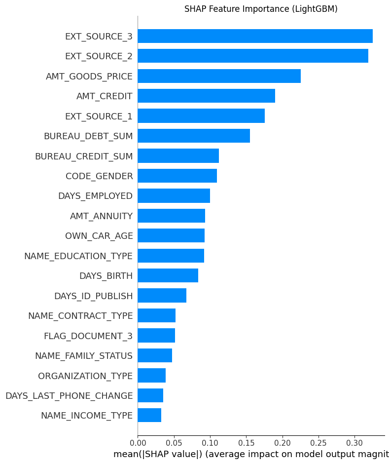
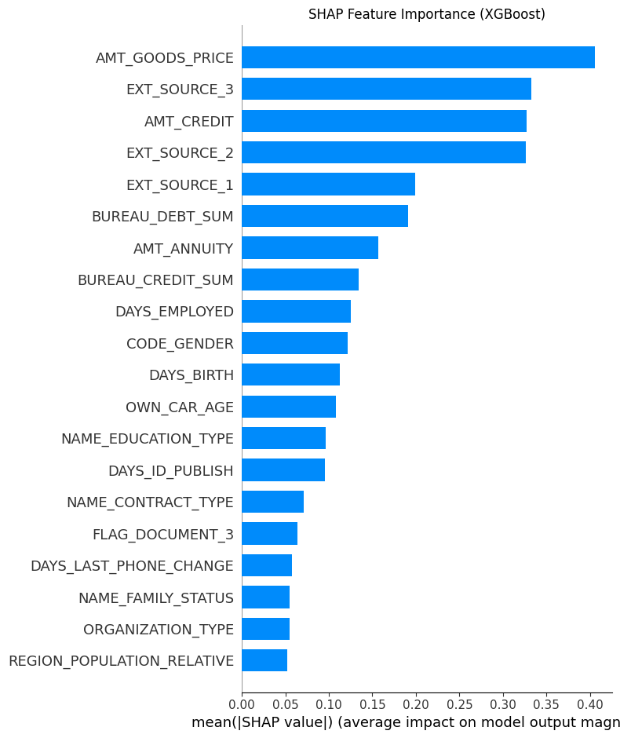
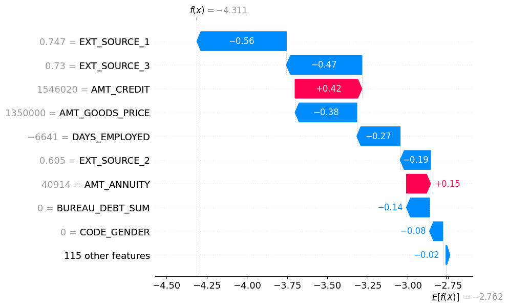

#  Credit Risk Analysis with LightGBM, XGBoost, and SHAP

This project presents a detailed implementation of **credit default prediction** using gradient-boosted decision trees. It leverages the [Home Credit Default Risk dataset](https://www.kaggle.com/competitions/home-credit-default-risk) to build interpretable models capable of identifying potentially risky loan applicants.

---

## Important terminologies
## Technical Primer: Algorithms and Interpretability

### What is XGBoost?

XGBoost (Extreme Gradient Boosting) is an efficient and scalable implementation of gradient-boosted decision trees. It is particularly effective for structured/tabular datasets and is widely used in machine learning competitions.

Key characteristics:
- Regularization (L1 and L2) to reduce overfitting
- Tree boosting via gradient descent optimization
- Row and column subsampling for variance reduction
- Parallel and distributed training for speed

XGBoost builds models iteratively, where each new tree corrects the residuals of the previous ones.

---

### What is LightGBM?

LightGBM (Light Gradient Boosting Machine) is a high-performance gradient boosting framework developed by Microsoft. It is optimized for both speed and efficiency, especially on large datasets with categorical features.

Key features:
- Histogram-based split finding
- Leaf-wise tree growth with depth constraints
- Efficient handling of categorical variables
- Lower memory usage and faster training compared to XGBoost

LightGBM is particularly suitable for high-dimensional, sparse data and is often preferred in large-scale production pipelines.

---

### What is SHAP?

SHAP (SHapley Additive exPlanations) is a unified framework for interpreting machine learning predictions based on game theory. It attributes to each feature the contribution it made to a particular prediction, ensuring fairness and consistency.

Key principles:
- SHAP values represent the average marginal contribution of a feature across all possible coalitions (feature combinations).
- The sum of SHAP values for all features equals the difference between the actual model output and the expected output.
- Provides both global interpretability (feature importance across all samples) and local interpretability (why a model predicted a specific value for one sample).

SHAP visualizations used in this project include:
- Summary bar plots to rank global feature importance
- Waterfall plots to explain individual predictions

---

### Why Interpretability Matters

In credit risk modeling, interpretability is crucial due to:

- Regulatory compliance (e.g., explaining loan rejection decisions)
- Transparency for stakeholders and clients
- Trustworthiness and fairness in automated decision-making systems
- Model debugging and feature selection insights

By combining SHAP with high-performing models like XGBoost and LightGBM, we ensure that our predictions are not only accurate but also explainable and reliable.


##  Objective

- Predict the probability of **loan default** from loan application and credit history.
- Engineer features from auxiliary data (e.g., `bureau.csv`) to capture behavioral signals.
- Train **LightGBM** and **XGBoost** models and evaluate via **AUC-ROC**.
- Apply **SHAP** to explain global feature importance and local applicant risk.

---

##  Methodology

### 1. Data Sources

- `application_train.csv` — Main data with features and binary target
- `bureau.csv` — Applicant credit records from other institutions
- `application_test.csv` — Hold-out data for simulation/testing

### 2. Data Preprocessing

- Merged `bureau.csv` aggregates:  
  - `BUREAU_OVERDUE_MEAN`, `BUREAU_OVERDUE_MAX`, `BUREAU_CREDIT_SUM`, etc.
- Missing values handled via:
  - Median imputation for numerics
  - Mode imputation + `LabelEncoder` for categoricals
- Removed ID columns (`SK_ID_CURR`) post-merge

### 3. Feature Construction

- Final feature matrix `X` included over 100 features
- Target variable: `y = application_train['TARGET']`
- All object columns converted to numeric labels

### 4. Model Training

#### LightGBM

LightGBM AUC-ROC = 0.7634
XGBoost AUC-ROC = 0.7605

---

##  Models and Results

| Model    | AUC (Validation) |
| -------- | ---------------- |
| LightGBM | 0.7634             |
| XGBoost  | 0.7605             |

- Used `StratifiedShuffleSplit` with 20% validation
- Evaluated with AUC-ROC on unseen validation data
- `application_test.csv` used for simulated production prediction
- Features like `EXT_SOURCE_1` and `CREDIT_DAY_OVERDUE` were top predictors

---

##  Interpretability with SHAP

SHAP was used to analyze both global and individual predictions:

- `EXT_SOURCE_1`: Strong negative correlation with default
- `DAYS_CREDIT_ENDDATE`: Longer pending credits increase risk
- Visualized summary plots and individual waterfall explanations

---
### SHAP Summary Plot — LightGBM



### SHAP Summary Plot — XGBoost



---

## Local SHAP Explanation

The SHAP waterfall plot below explains the model's prediction for a single applicant.

It breaks down the contribution of each feature to the final model output (log-odds), showing how the prediction deviates from the base expectation.

### Example: Applicant `SK_ID_CURR = 100001`



**Interpretation:**
- **Base value**: `E[f(x)] = -2.762` — the average model prediction (log-odds of default) over all applicants.
- **Model output**: `f(x) = -4.311` — the final prediction for this applicant, indicating a **very low probability of default**.

### Key Insights:

- Features like `EXT_SOURCE_1`, `EXT_SOURCE_3`, and `DAYS_EMPLOYED` significantly **reduced risk** (blue bars).
- Features like `AMT_CREDIT` and `AMT_ANNUITY` slightly **increased risk** (red bars).
- Features such as `CODE_GENDER` and `BUREAU_DEBT_SUM` had minimal effect.

To convert the log-odds output into a probability:

```python
from scipy.special import expit
expit(-4.311)  # ≈ 0.0132


---
##  Sample Output

```python
predict_risk(sk_id=100001)
# → Shows SHAP waterfall and risk score: 0.87 (high risk)
```

---

### Key Insight: Most Influential Features

Among all features, **EXT_SOURCE_1** and **AMT_CREDIT** emerged as top contributors to model predictions:

- `EXT_SOURCE_1`: An external credit score representing the applicant’s reliability, where **higher values indicate lower risk**. SHAP analysis revealed this as the most **protective** factor against default.
- `AMT_CREDIT`: The total amount of credit applied for by the applicant. Larger loan amounts were strongly associated with **higher risk**, making this a key **risk-driving** feature.

These insights were derived from SHAP summary and waterfall plots, providing transparency into how the model reasons about creditworthiness.


---


## Conclusion

This project demonstrates a complete credit risk modeling pipeline built on the Home Credit Default Risk dataset. We successfully:

- Preprocessed and integrated multiple data sources covering 300K+ loan applications
- Engineered domain-specific risk features and handled missing data robustly
- Trained and evaluated high-performance models (LightGBM and XGBoost), achieving AUC-ROC scores of 0.7634 and 0.7605 respectively
- Applied SHAP for detailed interpretability — both global (feature importance) and local (individual decisions)

---


##  Author

Adwait Shelke · [GitHub](https://github.com/adwaitshelke) · [LinkedIn](https://www.linkedin.com)

---


